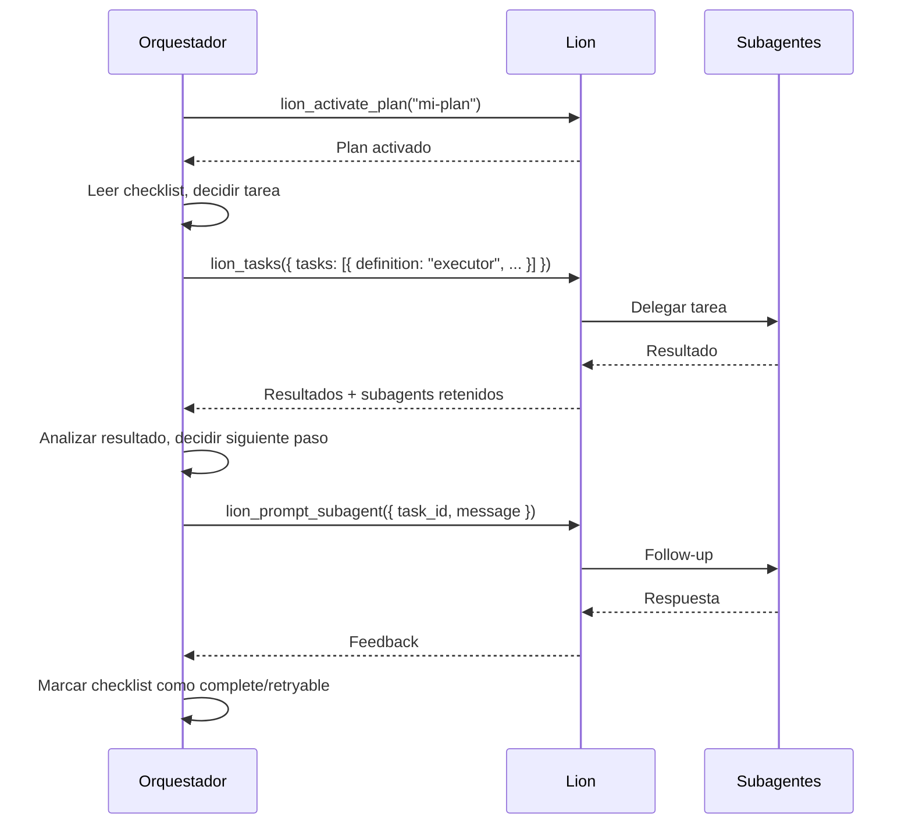
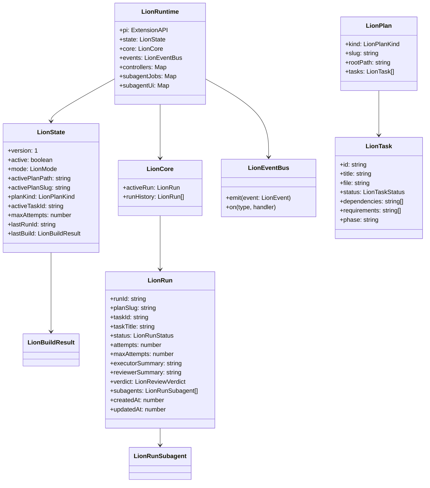

# Lion Extension

Extension de orquestacion para pi coding agent. Proporciona planificacion estructurada y delegacion de tareas a subagentes. El orquestador (agente principal) mantiene el control total del flujo.

## Principio de Diseno

Lion no toma decisiones por el orquestador. Es un mecanismo de delegacion: el orquestador decide que hacer, construye los prompts, y usa Lion para lanzar subagentes. Lion solo ejecuta lo que el orquestador le pide.

## Flujo de Uso



## Tools

### Plan Management

| Tool | Proposito |
|------|-----------|
| `lion_activate_plan` | Activar un plan por referencia (slug, path, o nombre) |
| `lion_validate_plan` | Validar plan con analyzer read-only |
| `lion_retry_task` | Resetear tarea blocked/failed a retryable |

### Task Execution

| Tool | Proposito |
|------|-----------|
| `lion_tasks` | Delegar tareas explicitas a subagents. Requiere array `tasks` |
| `lion_prompt_subagent` | Enviar follow-up a subagent retenido |

### Observability

| Tool | Proposito |
|------|-----------|
| `lion_subagent_status` | Status de subagents (con/sin task_id) |
| `lion_cancel_subagent` | Cancelar subagent atascado |

## Ejemplo de Uso

```typescript
// 1. Activar plan
lion_activate_plan({ reference: "mi-plan" })

// 2. Delegar tarea explicita
lion_tasks({
  strategy: "sequential",
  tasks: [
    {
      definition: "executor",
      title: "Implementar feature X",
      prompt: "Implementa la feature X segun el brief en tasks/T-001.md..."
    }
  ]
})

// 3. El orquestador recibe resultados y decide:
//    - Si esta bien: marcar checklist como complete
//    - Si necesita ajustes: lion_prompt_subagent para follow-up
//    - Si fallo: lion_retry_task y reintentar
```

## Modelo de Datos



## Estados de Tarea (LionTaskStatus)

| Estado | Descripcion |
|--------|-------------|
| `pending` | Tarea pendiente de ejecucion |
| `in_progress` | Tarea en ejecucion |
| `complete` | Tarea completada |
| `blocked` | Tarea bloqueada por dependencias fallidas |
| `retryable` | Tarea que fallo pero puede reintentarse |
